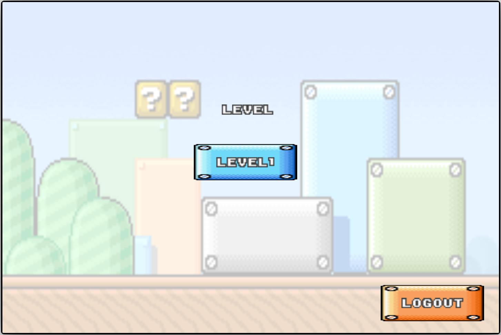
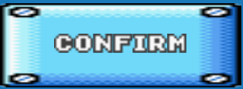

# Software Studio 2023 Spring Assignment 2

## Mario Game

## Announcements

This is a project of the 2023 Spring Software studio class in National Tsing Hua University.
The program is written by daisyliu0225.

### Scoring

|  **Basic Component**  | **Score** | **Check** |
| :-------------------: | :-------: | :-------: |
| Complete Game Process |    5%     |     Y     |
|      Basic Rules      |    55%    |     Y     |
|      Animations       |    10%    |     Y     |
|     Sound Effects     |    10%    |     Y     |
|          UI           |    10%    |     Y     |

|   **Advanced Component**   | **Score** | **Check** |
| :------------------------: | :-------: | :-------: |
|      firebase deploy       |    5%     |     Y     |
|        Leaderboard         |    5%     |     N     |
| Offline multi-player game  |    5%     |     N     |
|  Online multi-player game  |    10%    |     N     |
| Others [name of functions] |   1-10%   |     N     |

---

## Basic Components Description

### World map

There is a world map in the game. 
To choose the level, click on the buttons on the level scene.
- level scene
- 

 

After choosing the level, the start scene pops out. After three seconds, it changes to the main scene.
- start scene
- 
- main(game) scene
- 

 

Inside the world map, there are the following components.
- Info bar
- Player
- Enemy
  - goomba
  - turtle
- Question blocks
  - coin question block
  - shroom question block
 
The effects in the world map are animations and sound effects.

### Info bar
The info bar is always stuck on the camera. It shows the remaining lives, time, coins and also the score.  
The info mentioned has the same sequence as the picture below.
- info bar
- 

### Player

The player has to control the mario in the game.
- player pic
- 

> [!IMPORTANT]
> Make mario move. 
  > **keyboard left**: mario goes left. 
  > **keyboard right**: mario goes right. 
  > **keyboard up**: mario jumps. 

 

- Life
  - To know how much lives left, look at the life in the info bar.
  - 
  - Initially, mario will have 5 lives. Mario will have the last chance to get through the level when life is 0.
  - Lose life
    - Mario will lose a life if he collides with the enemy and the collision spot is not higher than the enemy.
    - Mario will lose a life as well if he falls outside the map. (i.e. falls into hole)
  - There are no way to gain life in the game.
  - The life will reset if the player loses or successfully get through the game.
 

 - Game over
   - After mario loses all the life, the game over scene pops out. The player can try the level again. Everything on the info will be reset.
   - Also, if the time runs out, the game over scene will also pop out.
   - After the game over scene, the game goes to the level scene.
   - To know how much lives left, look at the timer in the info bar.
   - 
   - Game over scene
   - 

 

  - Game win
    - To win the game, mario has to touch the flag.
    - 
    - After touching the flag, the game win scene pops out. The win sound effect plays.  After three seconds, the scene will change back to level scene.
    - game win scene
    - 

 

### Enemies

There are two enemies in the game. The two enemies' mechanisms are a little different.

- Goomba

  - picture
  - 
  - mechanism
  1. If the player touches goombas, the player will lose a life.
  2. If the player hits goombas by head, the goomba will die.

      

- Turtle
  - picture
  - 
  - mechanism
  1. If the player touches turtles, the player will lose a life.
  2. If the player hits turtles by head, the turtle will become "the rolling turtle", "the rolling turtle"'s speed is much faster and the player is not able to kill the rolling turtle.
  - rolling turtle
  - 

 

### Question Blocks

There are two kinds of question blocks in the game. To know what is inside the question block, the player has to control mario and hit the block's bottom.  
The question blocks look the same, so only when hitting the block will the player know what is inside the block.  
- Shroom block
- Coin block

### Animations

The animations ae used on player(mario) and the enemies.

- Player
  - mario idle
  - 
  - mario jump
  - 
  - mario run
  - 
  - Big mario idle
  - 
  - Big mario jump
  - 
  - Big mario run
  -  
- Enemies
  - Goomba
  - 
  - Turtle
  - turtle walk
  - 
  - turtle roll
  - 

 

### Sound effects

The sound effects are used on all parts in the game.

- bgm 
  Two bgm are used in the game.
  - The first bgm is used on the login/signup and scene select.
  - The second bgm is used on the playing scene.
     
- sound effects 
  The sound effects are as the following. 

  #### Sound effects used on player 

  The sound effects used on the player will not stop the bgm.  

  - jump effect
    - sound effect code: jump 
    - The sound effect is used on when mario jumps. 
  - coin effect
    - sound effect code: coin 
    - The sound effect is used when the mario touches the coin.  
  - power up effect
    - sound effect code: PowerUp  
    - The sound effect is used when mario eats the mushroom  
  - power down effect
    - sound effect code: powerUpAppear 
    - The sound effect is used when mario loses the power up effect  
  - stomp effect
    - sound effect code: stomp  
    - The sound effect is used when mario stomps on the enemy's head.  

  #### Sound effects used on background

  The sound effects used on the background will stop the bgm.  

  - lose effect
    - sound effect code: Game Over 
    - The sound effect is used when the player loses all the life 
  - win effect
    - sound effect code: levelClear 
    - The sound effect is used when the player successfully gets through the level. 
  - lose one life
    - sound effect code: loseOneLife  
    - The sound effect is used when the player loses a life.  

### UI
The UI is the info bar.

## Advanced Component Description

### Login/Signup function
#### Signup function
- To sign up, click on the signup button on the menu scene.
- menu
- 
- signup button
-  
- After clicking on the signup button, the scene goes to the signup scene.
-  
- Type in email and password and press confirm.
- 
- If you wanted to cancel, then press cancel.
-  
- After pressing confirm, the scene goes to level scene.
- 

 

#### Login function
## Firebase page link (if you deploy)

[your web page URL](https://softwarestudiomario.web.app/)

## Versions

| Version | Date       | Description                    |
| ------- | ---------- | ------------------------------ |
| 1       | 2024/05/11 | finished level and menu scenes |
| 2       | 2024/05/11 | level 1 background             |
| 3       | 2024/05/12 | mario can move                 |
| 4       | 2024/05/15 | jump using colliding box       |
| 5       | 2024/05/17 | physics finished               |
| 6       | 2024/05/17 | camera finished                |
| 7       | 2024/05/18 | enemies finished               |
| 8       | 2024/05/19 | question coin finished         |
| 9       | 2024/05/21 | animations                     |
| 10      | 2024/05/22 | shroom question box            |
| 11      | 2024/05/23 | firebase deploy/login          |

--daisyliu0225

